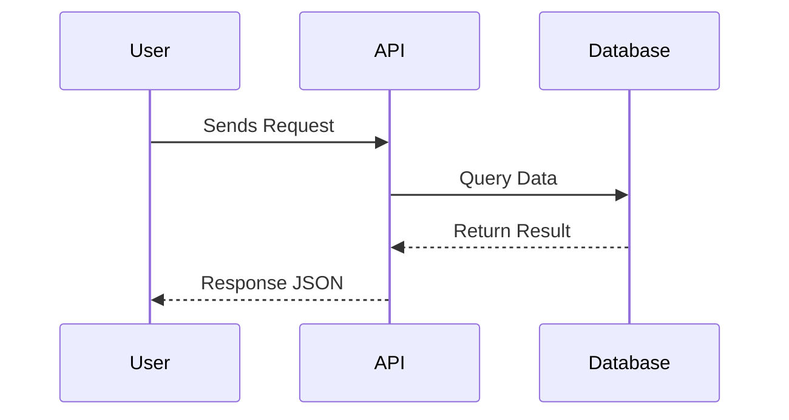

🧩 In technical documentation, words alone can’t always capture architecture or flow.  
That’s where **diagram-as-code** tools like **Mermaid** and **PlantUML** change the game.

---

### Why It Matters
Traditional diagrams (drawn in Visio, Lucidchart, or Figma) look great — until you need to update them.  
With Mermaid or PlantUML, diagrams **live with the code**:  
- Version-controlled in Git  
- Diff-able, reviewable, and easy to regenerate  
- No proprietary software or manual redrawing

---

### Mermaid for Lightweight Diagrams
Perfect for quick visuals inside markdown, like sequence diagrams or workflows.



- ✅ Use when: you’re embedding small diagrams inside docs or READMEs.
- 🧠 Bonus: GitHub and many doc tools render Mermaid natively.

## PlantUML for Complex Systems

PlantUML shines for architectural or component-level views where reuse and templates matter.

```
@startuml
package "Bizee Platform" {
  [Website] --> [API Gateway]
  [API Gateway] --> [Nebula Service]
  [Nebula Service] --> [Quantum Processor]
}
@enduml
```

💡 Use when: you’re generating consistent diagrams across multiple docs, or need class/state diagrams with detail.

### When to Use Each

| Task                             | Best Tool    |
| -------------------------------- | ------------ |
| Quick flowchart or sequence      | **Mermaid**  |
| Detailed system or UML           | **PlantUML** |
| Auto-generation from text/code   | **PlantUML** |
| Markdown embedding (docs, wikis) | **Mermaid**  |

## Takeaway
Diagrams shouldn’t slow you down — they should evolve with your documentation.
Start small: add a Mermaid block in your next README.
When you need structure and reusability, move up to PlantUML.
Diagram-driven docs are the bridge between engineering and clarity.


